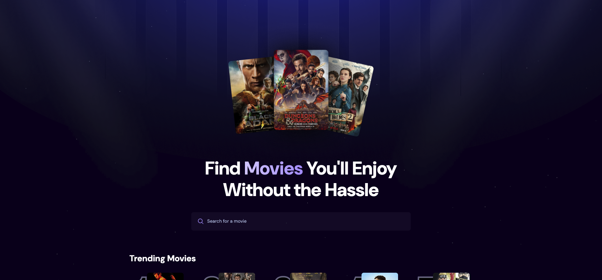
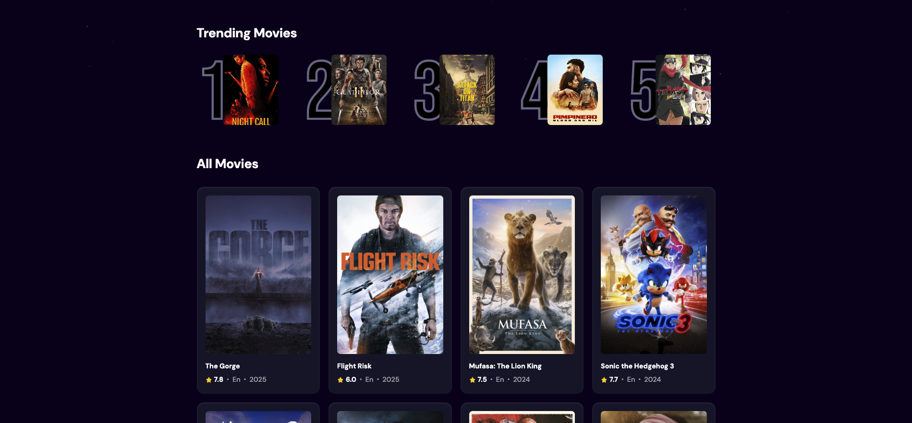

# Movie Search Application

A modern React application for discovering and searching movies, with trending analytics and real-time search capabilities.

## Table of Contents

- [Overview](#overview)
- [Screenshot](#screenshot)
- [Features](#features)
- [Technology Stack](#technology-stack)

## Overview

This movie search application provides users with an intuitive interface to discover movies, track trending searches, and find detailed information about films. Built with modern React practices and real-time search capabilities.

## Screenshots

## Features

- **Real-time Search** – Dynamic search with debounce optimization
- **Trending Movies** – Track and display most searched movies
- **Analytics Integration** – Search tracking with Appwrite backend
- **Responsive Design** – Mobile-first approach with Tailwind CSS
- **Performance Optimized** – Debounced search and efficient rendering

## Technology Stack

🛠️ **Built with:**

- **React** – Frontend framework
- **Tailwind CSS** – Styling and responsive design
- **TMDB API** – Movie database integration
- **Appwrite** – Backend as a service
